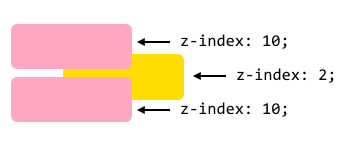

#  Positioning

### LEARNING OBJECTIVES
*After this lesson, you will be able to:*

- Explain the difference between static, relative, fixed, and absolute positioning.
- Use cases of static, relative, fixed, and absolute positioning. 

<a name="introduction-positioning"></a>
## Introduction: Positioning 

The CSS `position` property is a way to build more complexity into your page layout; creating things like a sticky header that remains in place as the user scrolls, or text that appears on top of an image. Let's look at some examples.

***

<a name="demo-positioning"></a>
## Demo: Positioning


### Static
The default value of every element is `static.` A `static` object receives its layout rules from properties such as `display` and `float`, and is considered an 'un-positioned' element. Any element that has a value other than `static` is referred to as a 'positioned' element.

### Relative
Using `position: relative;` is a way to position an element within the document flow, in relation to that element's original static position.

For example, let's place two divs on our page and view them in their natural document flow:

```html
<div class="first"></div>
<div class="second"></div>
```

```css
div {
  height: 100px;
}

.first {
  border: 1px solid blue;
}

.second {
  border: 1px solid red;
}
```

# 

Looks like we'd expect. What if we set the second `div` to `position: relative;`?

# 

No change! This is because the element has not received any information on *where* it should be placed in relation to its natural position in the flow. We can give it specific instructions using the `top`, `bottom`, `right`, and `left` properties, like so:

```css
.second {
  position: relative;
  top: -50px;
  left: 20px;
  border: 1px solid red;
}
```

# 

Wow! The second `div` moved `-50px` from its original `top` position in the flow, and `20px` away from its original `left` position. To help make sense of the negative values, consider the element's starting `xy` position in the flow to be at `0, 0`.

> Note that the element has not been removed from the document flow. In other words, the rest of the page still acts as if `.second` is in the spot that it originally occupied.

### Absolute
An element that has been styled with `position: absolute;` will remove that element from the rest of the document flow, and position it in relation to the closest positioned element. (Remember that any element with a value other than `static` is considered positioned.) If there are no other positioned elements on the page, the `absolute` element will use the `<body>` as a reference object.

Because `position: absolute;` elements work in tandem with other positioned elements, you must set the reference element to `position: relative;`. Let's look at an example.

```html
<figure>
  
  <figcaption>Cat Burrito</figcaption>
</figure>
```

```css
  figure {
    width: 50%;
    margin: auto;
  }

  figcaption {
    position: absolute;
  }
```

# 

Similar to `relative` elements, the `absolute` element needs specific instructions on where it's meant to be positioned. Let's place the `figcaption` in the bottom-right corner of the photo:

```css
  figcaption {
    position: absolute;
    bottom: 10px;
    right: 10px;
  }
```

# 

What did we miss? Our caption appears at the bottom-right of the *page*, not our `figure` as we expected.

The answer:

```css
figure {
  position: relative;
  width: 50%;
  margin: auto;
}
```

That's right! We need to set a position on a parent or ancestor &mdash; `figure` in this case &mdash; so that `<figcaption>` can be absolutely placed in relation to that element.

# 

### Fixed
A `fixed` element is not only removed from the document flow, but also stays in its position as the user scrolls on the page. A common `fixed` element is the `nav`. Let's see it in action. Here's the `nav` in its natural flow of the document:

# 

```html
<nav>
  <a href="#">About</a>
  <a href="#">Portfolio</a>
  <a href="#">Contact</a>
</nav>

<h1>Welcome to my site!</h1>
<p>Lorem ipsum dolor sit amet, consectetur adipisicing elit. Adipisci veritatis id aspernatur minus cum similique iusto sunt quasi nostrum, voluptate reiciendis sequi ducimus beatae et? Quis doloribus, sequi commodi obcaecati?</p>
```

```css
nav {
  background: #eee;
  padding: 40px;
}
```
By default, the nav will scroll with the rest of the page.

What happens when we set the `nav` to `position: fixed;`?

# 

What happened? Let's break down the changes we're seeing.
- As we know, a `fixed` element is taken out of the document flow. This means it will position itself in the top-left corner of the document.
- A `fixed` element also loses its default `width` when it's removed from the document flow. We can easily rest it using the `width` property.
- It's also important that we remember the `top` and `left` properties to reinforce the `nav`'s position in the document.

```css
nav {
  background: #eee;
  padding: 40px;
  position: absolute;
  width: 100%;
  top: 0;
  left: 0;
}
```

# 

The `nav` looks correct, but it's hiding the rest of the page content! This is also caused by the `fixed` element being removed from the document flow. Simply move the other elements down using `margin` or `padding`!

```css
h1 {
  margin-top: 100px;
}
```

# 

Great! Now we have a sticky `nav` that will stay at the top of the page while the user scrolls.


### z-index

With relative, absolute, and fixed positioning, elements can overlap.
We can use the `z-index` property to control which elements are layered on top of each other.

This property takes a number — the higher the number, the closer that element is to the front.

`z-index` functions similarly to  "bring to front" and "send to back" in design programs.

Example:

```css
.yellow {
  	z-index: 2;
}

.pink {
  	z-index: 10;
}

```



***


## Hungry for More?
### Exercises
- [CSS Positioning Practice](exercises/positioning-practice) (Easy/Medium - 15 minutes)
- [Codecademy &mdash; Positioning Exercises](https://www.codecademy.com/courses/web-beginner-en-6merh/2/1)
- [CSS Diner Game](https://flukeout.github.io/)

### Videos
- [CSS Position](https://www.youtube.com/watch?v=zH8kjJdvmOs&list=PLdnONIhPScST0Vy4LrIZiYKpFNoxgyH7J&index=8)

### Readings
- [CSS Positioning Explained by Building an Ice Cream Sundae](https://medium.freecodecamp.com/css-positioning-explained-by-building-an-ice-cream-sundae-831cb884bfa9?gi=9bc90f76062b)
- [A List Apart &mdash; CSS Positioning 101](http://alistapart.com/article/css-positioning-101)
- [The Lowdown on Absolute vs. Relative Positioning](https://codemyviews.com/blog/the-lowdown-on-absolute-vs-relative-positioning)
